# Robot Motion Planning
Chris Miller '20

### PRM

The PRM builds a roadmap in `build_roadmap()`. This generates random valid configurations and creates a vertex. It then pulls the 15 closest neighbors of the random config using `get_NNs()`. It then checks the distances returned by `get_NNs()` to see which of the points (if any) are within the defined distance epsilon (which determines how far apart two valid configurations can be for us to link them directly). For any neighbors within the distance epsilon, the function adds an undirected edge between the neighbor and the new configuration. 

`get_NNs()` is implemented using SciKitLearn's NearestNeighbors model. When adding points it first fits to the current dataset (since the set is updating constantly) then gets the nearest points using sklearn's `model.kneighbors()` function.

In the query phase, we use `query()`, which accepts a start and goal configuration and attempts to link them. 

First, the function attempts to link each configuration to the generated roadmap, returning failure if it is unable to do so. To maximize chances of finding a path, it chooses the valid nearest neighbor (within distance epsilon) which has the highest outdegree. This makes it more likely for a connection to reach many other points and thus ultimately the goal. 

On the backend, the PRM object stores current configurations, link numbers and lengths,  link positions and lines, obstacles in the environment, and the current graph and nearest neighbor model, as well as hyperparameters such as number of samples to take and the distance epsilon.

Searches are implemented as a simple BFS to ensure the shortest path possible across the roadmap (although clearly this path is completely reliant on the generated roadmap and may be very far from a truly optimal path).

#### Testing

I tested PRM with a variety of obstacles and link setups. More links than four typically led to impractical computation times due to the number of samples needed to adequately cover the state space. I found that three links typically allowed the algorithm to produce adequate coverage of the space (ie, was able to connect the start and goal to the graph and link them if doing so was possible) in a reasonable timeframe by taking 3500 samples.

I animated my configurations to show their paths, so my test mp4s (produced and saved with the matplotlib.animation library) are available in the images folder of this submission.

A basic example is PRM_Moving.mp4. The arm's most direct path between the configurations is blocked by obstacles, as shown here by the start configuration:
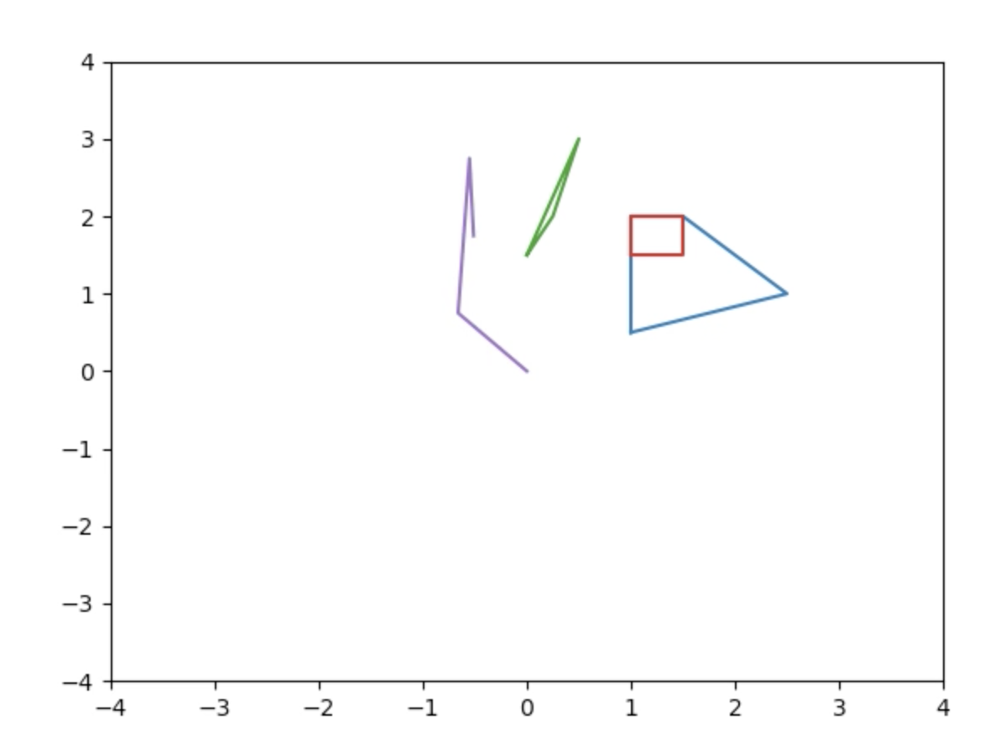
and goal configuration:
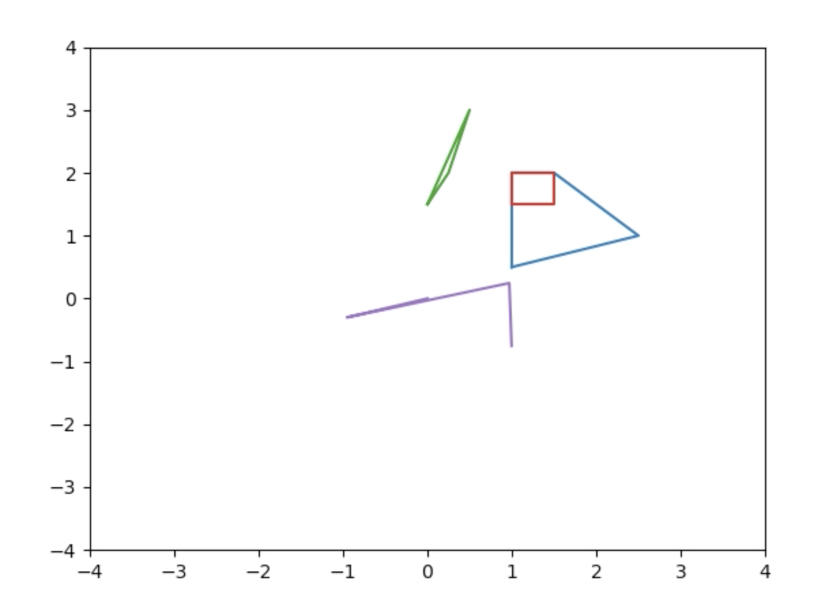

So the algorithm finds a path which travels counterclockwise, avoiding the obstacles in a simple manner.

In bigger_move.mp4, the algorithm avoids a larger obstacle by crunching itself up into a smaller spatial object. And in more_complex.mp4, we see the arm avoiding a larger collection of obstacles.

In a dense space, using the sum of angle changes as a distance metric can be problematic. Invalid.mp4 shows the configuration as it passes through the blue triangle. Both configurations are valid, but the movement action between them is not.

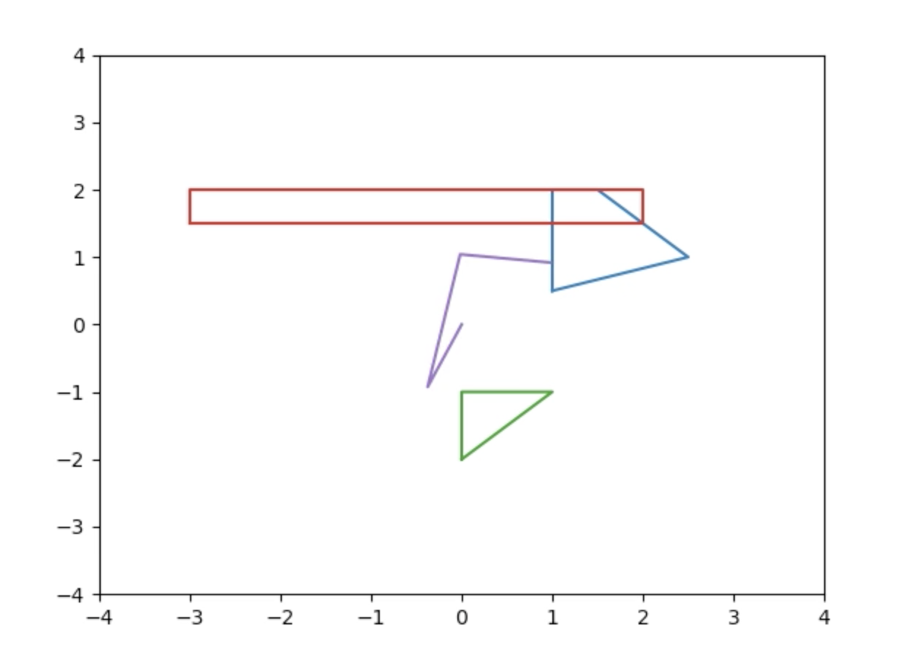

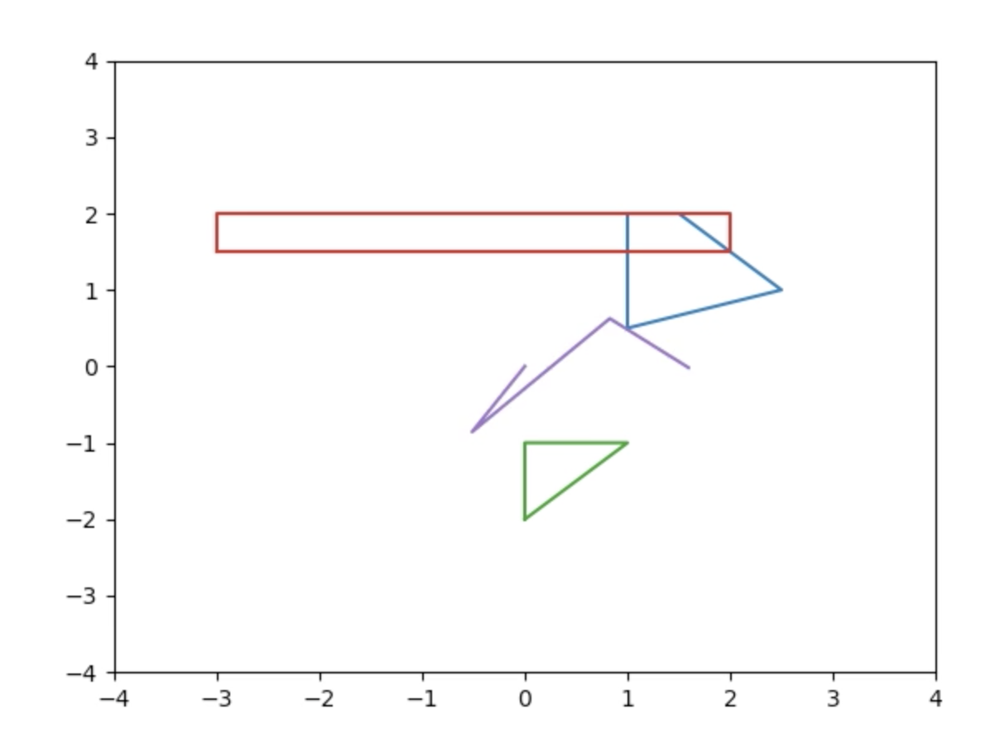

The problem is caused by the fact that the maximum "safe" distance was chosen as pi/16 * num_links. Since only one of the links here changes significantly, it has 3pi/16 radians of movement freedom, and since the link is longer the resulting xy position change is fairly large. Fixing this is possible, but would require heuristics (such as checking lines between configurations) or using very small distances (which increases the number of configurations we need to sample in order to produce a relatively well connected graph.

This problem is rectified with a smaller distance tolerance in complex_motion.mp4. In this setup, I use a tolerance of pi/32*num_links, allowing complex motion like this for navigation through narrow paths.

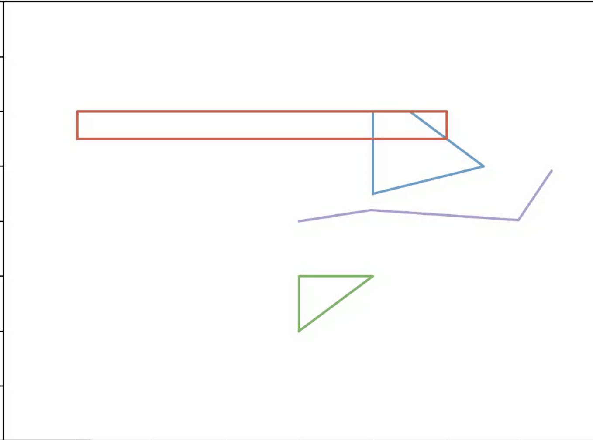
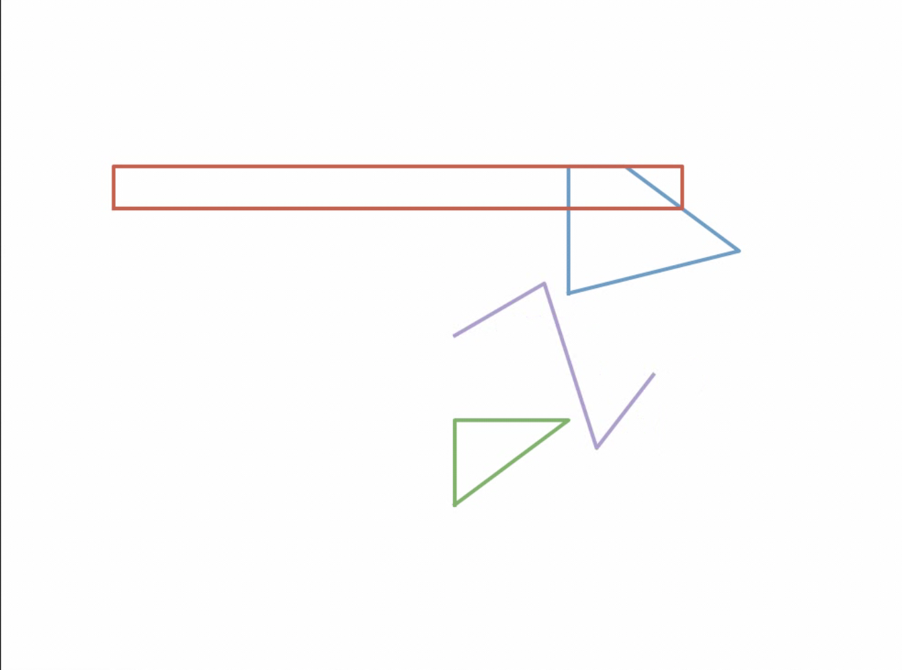
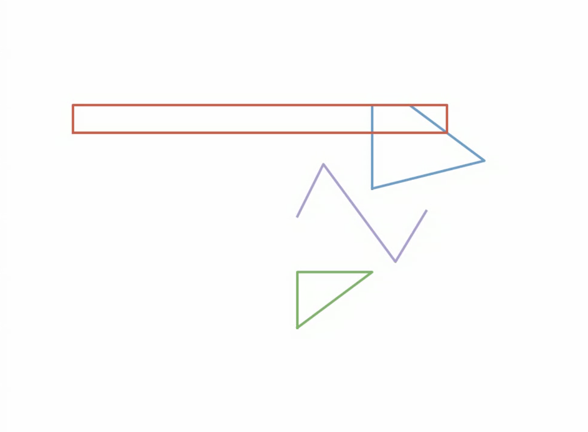
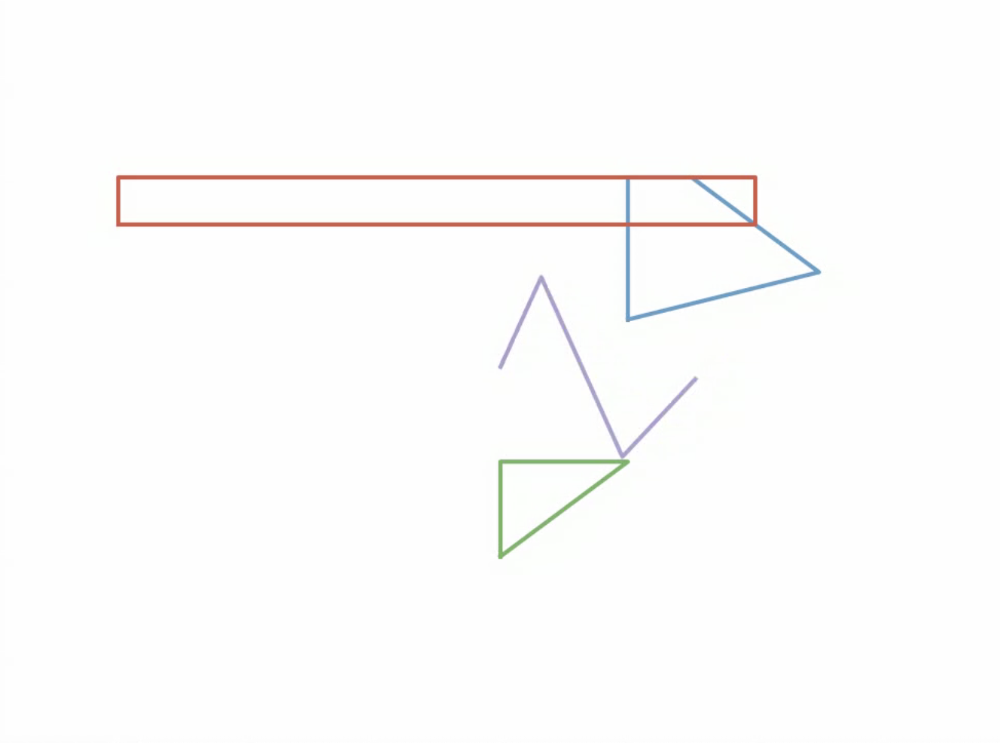
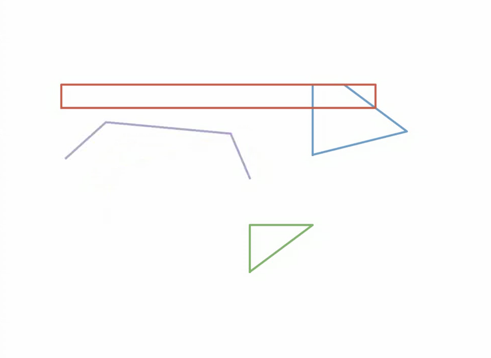

In the sequence, the robot arm moves down to allow the second link to pass the blue triangle, then back up to allow the third link to pass the green triangle before going through the passage and eventually reaching the final state.

### RRT

The RRT (Rapidly exploring Random Tree) algorithm samples a random point within the configuration space, then expands the closest graph node to that point by simulating all actions from that node and producing new nodes from those actions. This tends to spread the graph out to cover the entire space quickly, then slowly fill in to cover it densely. 

The main algorithm is implemented in `build_rand_tree()`. The function generates random samples from the full configuration space (x, y, and theta) and uses the `get_NN()` function (implemented almost identically to the one for PRM so I will not discuss it again) to find the nearest point to the random configuration. If the nearest point is not expanded, it expands the point by simulating every action from the point (in this case forwards/backwards/forwards right/forwards left/backwards right/backwards left) and linking those new nodes to the node which spawned them. 

The RRT object holds graph data, hyperparameters such as epsilon values for x/y and theta, controls, and a scale factor to indicate how important epsilon deviations are, as well as environmental parameters such as the x and y bounds of the space and any obstacles in the space (stored as shapely objects for extremely easy intersection calculation in `is_valid_move()`). 

Since the RRT algorithm assumes no local planner is available, we test each generated point to see if it is the goal, within a provided fudge factor (since exact matching would be nigh on impossible). To save computation, we also check if a node has been visited before by getting its approximate nearest neighbor (without needing to retrain) in `check_if_redundant()` and seeing if the new point is close enough to the old point for adding it to be useless.

Once we reach the goal, we backchain back to the start and display a visualization. I stored actions taken at each step of the solution and printed them, but chose not to use the simulation since it produced a similar output to my solution visualization code without colors or obstacles and used a robot geometry which was not modeled in the problem and thus did not reflect the actual robot model.

#### Testing

Start state: (2, 2, pi/4)

Here the operation is shown clearly. The explorer first reaches out distinct branches that cover almost the entire graph sparsely.

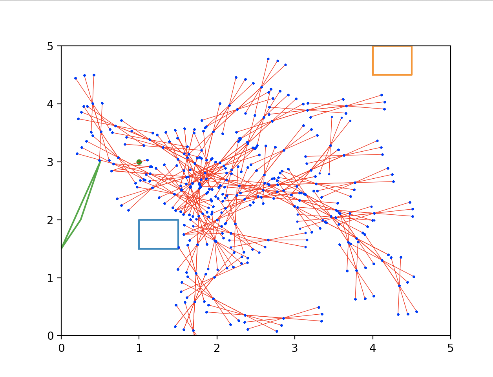

Then, given more time, it fills in the 'holes' in the graph densely, as in this example where the algorithm has found a path to the goal (4, 2.5, -pi/4).

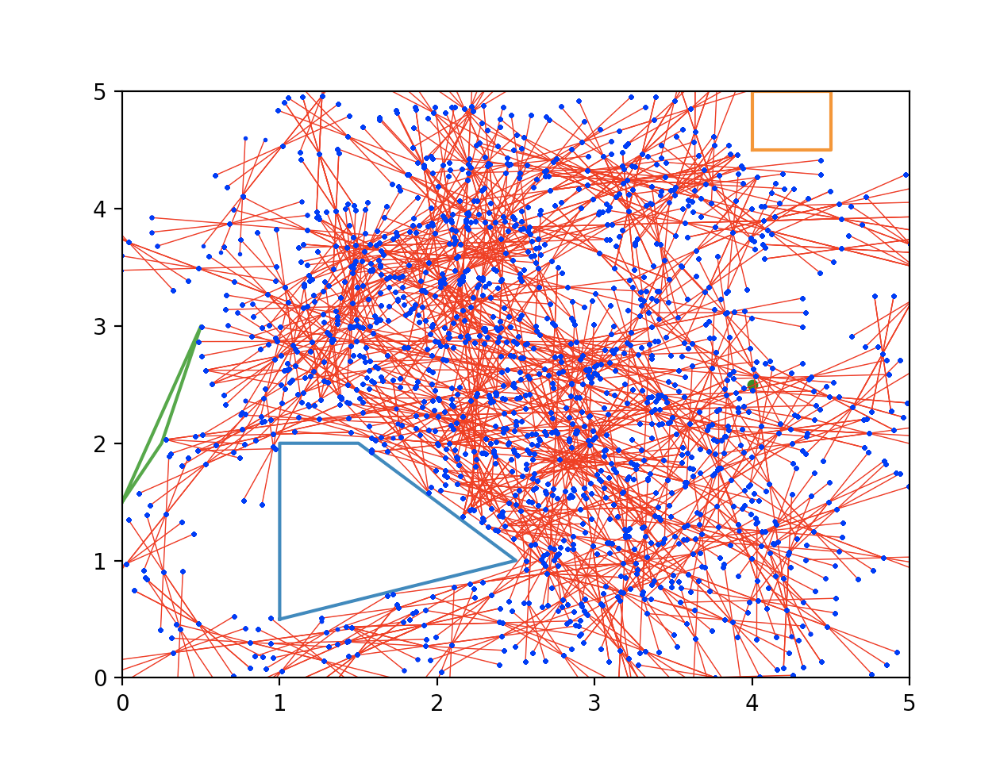

Here is an example of a path found with a step size of .5 (when expanding a node, the car travels .5 seconds for each instruction).

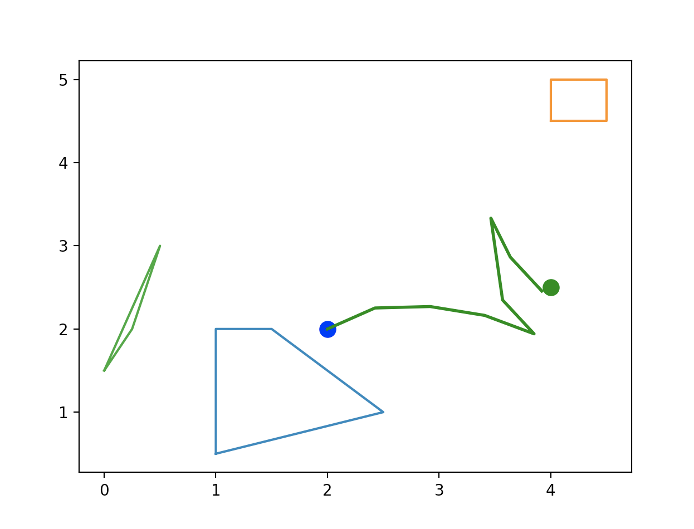

This is for the same goal as above. Note how the robot has to go up above the goal and then travel back down towards it to achieve the different goal orientation. Also notice how the path is not optimal. We could achieve a more optimal solution by building a full tree and then querying it using BFS, but this specific path was implemented as an online algorithm which finds and returns a path as soon as it recognizes the goal.  

Here is a path for a slightly more interesting goal, showcasing the algorithm's ability to navigate around obstacles:

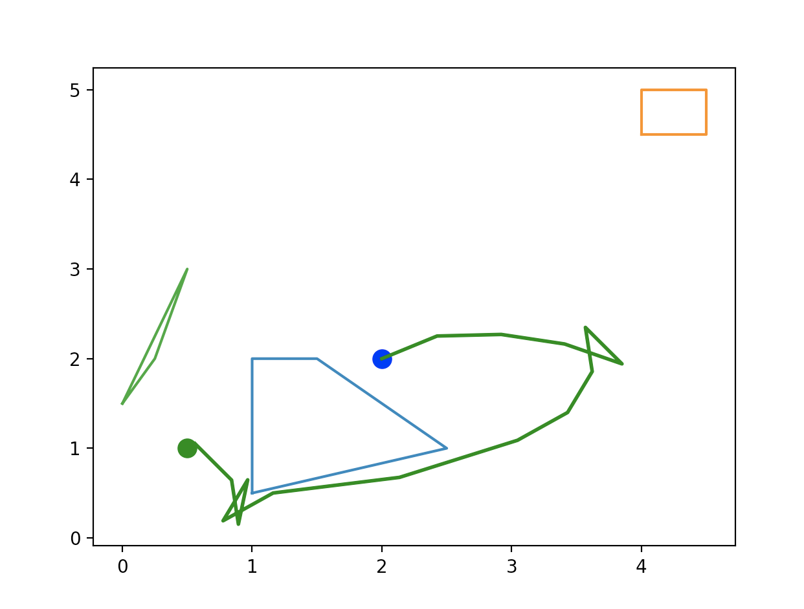

However, larger obstacles can challenge the algorithm. As shown here, the large upper rectangle blocks off a large portion of the free space. Any random points generated there will tend to try to expand the same points (below the rectangle) which will either be already expanded or will have expansions that are blocked by the obstacle.

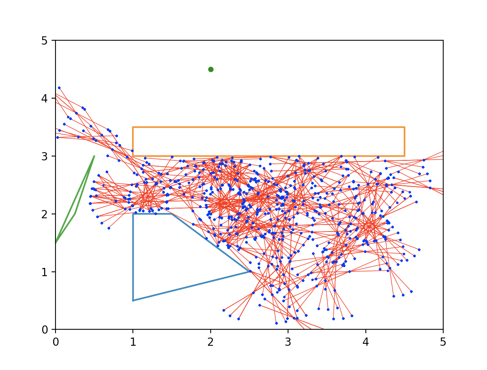

This takes over ten thousand samples to reach the goal, and produces an interesting turn pattern at the beginning to transition from facing up to facing left.

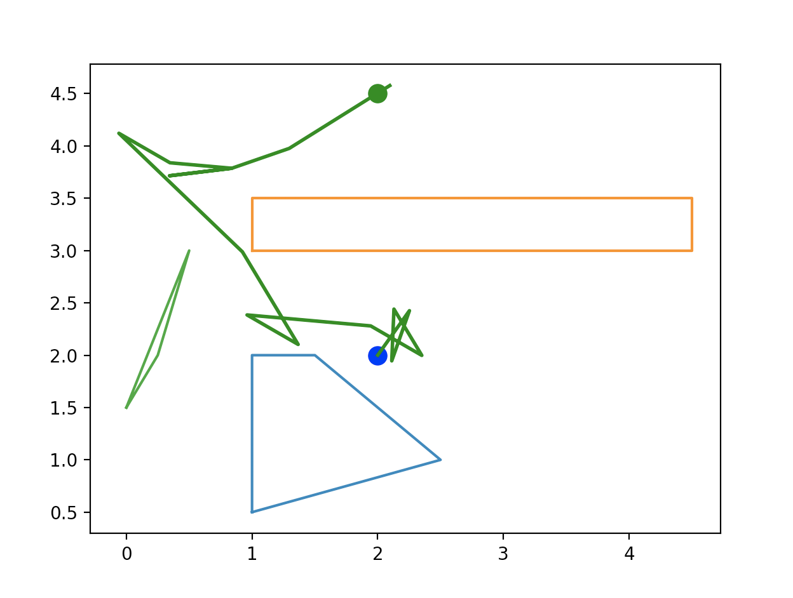

### Additions

As discussed, I implemented SciKitLearn's NearestNeighbor algorithm to speed neighbor finding. This was an important addition, since in spaces which require 
Live visualization of RRT building

My animation addon for the probabilistic roadmap uses matplotlib's animation library. I had to shift my code to use lists of x positions and y positions rather than directly using shapely points and linestrings for all tasks, then produced `animate()`, which takes a timestep i and accesses that configuration of the solution, converts it to xy positions using `get_xy_pos()`, and then updates the animation image. This was a bit tricky to debug, but produced the great mp4s displayed in my images folder.

I also decided to visualize the growth of the RRT's tree. Unfortunately efficient solutions I explored such as setting all xy data did not allow for discrete segments, and modules designed for large numbers of discrete segments, such as LineCollection, did not allow for easy updates for live viewing. Using plot and linking parent nodes to children allowed for discretized segments and worked well for sample sizes in the low thousands - any higher and vis should be set to false for efficient running and visualization of the result, produced by backchaining from the goal node to the start.